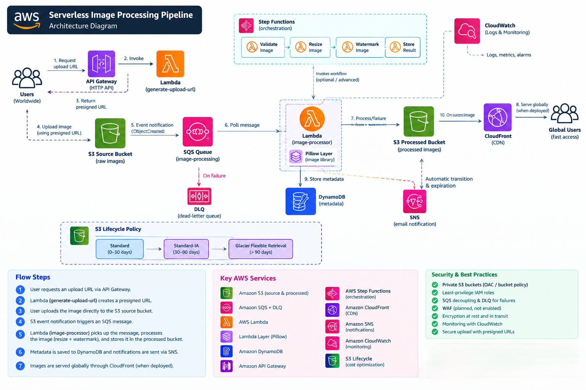
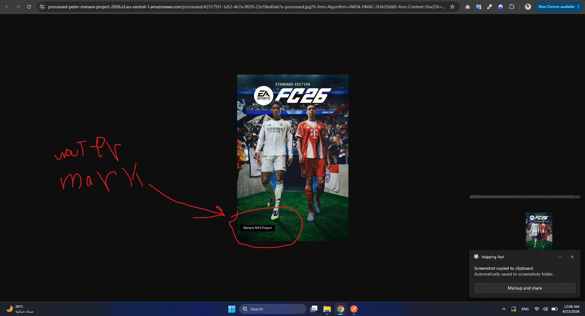
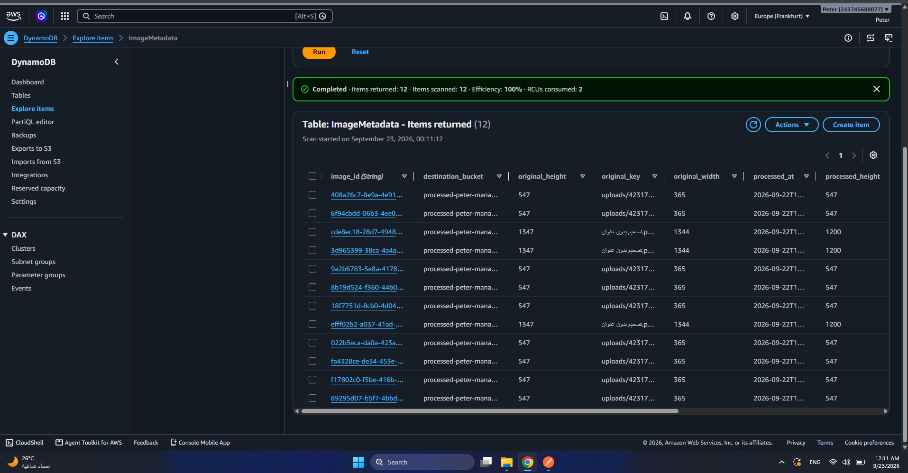
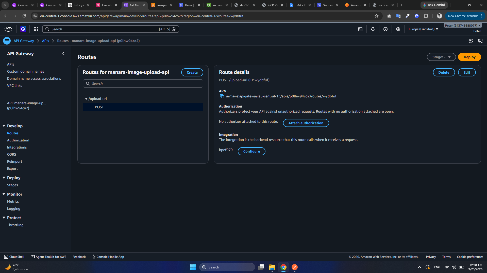
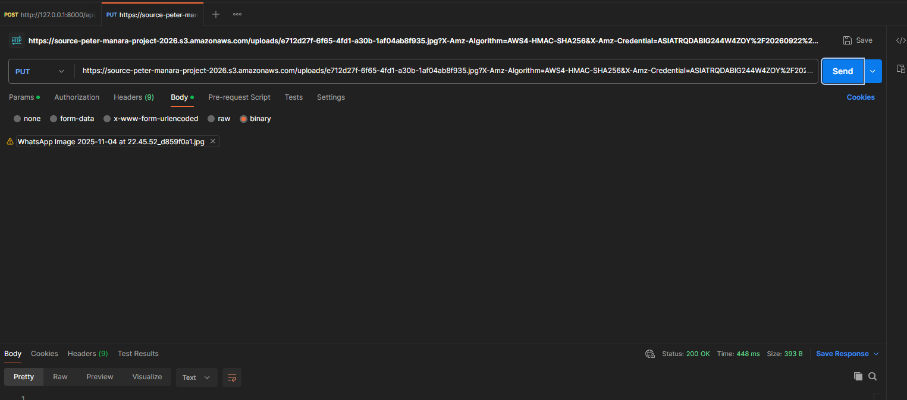
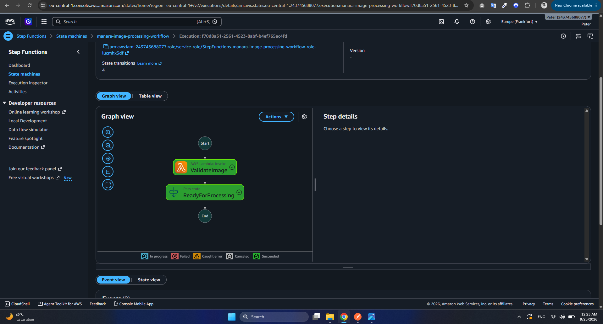
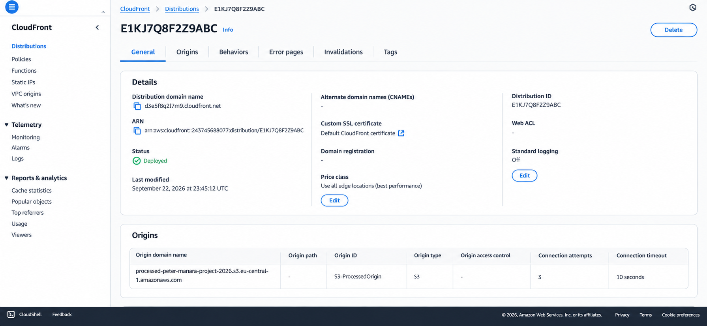

# Serverless Image Processing Pipeline on AWS

## Overview

This project implements a **serverless, event-driven image processing
pipeline on AWS**. Users request a temporary upload URL through Amazon
API Gateway, upload images directly to a private Amazon S3 source
bucket, and the images are processed asynchronously by AWS Lambda.

The processing function uses a **Pillow Lambda Layer** to resize images
and apply a watermark. Processed images are stored in a separate S3
bucket, while image metadata is recorded in Amazon DynamoDB. Amazon SQS
decouples uploads from processing, and a dead-letter queue (DLQ)
provides failure handling and retry resilience.

The project was built as an AWS Solutions Architect Associate graduation
project.

------------------------------------------------------------------------

## Architecture



### Main Flow

``` text
User
  |
  | POST /upload-url
  v
API Gateway
  |
  v
generate-upload-url Lambda
  |
  | Presigned URL
  v
S3 Source Bucket
  |
  | Object Created Event
  v
SQS Queue --------------------> Dead-Letter Queue
  |
  v
image-processor Lambda
  |
  +---- Pillow Layer
  |       - Resize
  |       - Watermark
  |
  +---------------------------> DynamoDB Metadata
  |
  v
S3 Processed Bucket
  |
  v
CloudFront
  |
  v
Global Users
```

A Step Functions workflow is also used to validate image input before
processing:

``` text
ValidateImage
     |
     v
ReadyForProcessing
     |
     v
Succeeded
```

------------------------------------------------------------------------

## AWS Services Used

  ---------------------------------------------------------------------
  AWS Service                        Purpose
  ---------------------------------- ----------------------------------
  Amazon S3                          Stores original and processed
                                     images

  Amazon SQS                         Decouples S3 upload events from
                                     image processing

  SQS Dead-Letter Queue              Stores messages that repeatedly
                                     fail processing

  AWS Lambda                         Generates upload URLs and
                                     processes images

  Lambda Layers                      Packages the Pillow
                                     image-processing dependency

  Amazon API Gateway                 Exposes the endpoint used to
                                     request upload URLs

  Amazon DynamoDB                    Stores image metadata and
                                     processing status

  AWS Step Functions                 Orchestrates image validation
                                     workflow

  Amazon CloudFront                  CDN layer for low-latency delivery
                                     of processed images

  Amazon CloudWatch                  Lambda logging and monitoring

  Amazon SNS                         Notification component for
                                     processing events

  S3 Lifecycle                       Moves older source objects to
                                     lower-cost storage classes
  ---------------------------------------------------------------------

------------------------------------------------------------------------

## How It Works

### 1. Request an Upload URL

The client sends:

``` http
POST /upload-url
```

to Amazon API Gateway.

API Gateway invokes the `generate-upload-url` Lambda function, which
creates a temporary Amazon S3 presigned URL.

Example request:

``` json
{
  "filename": "test-photo.jpg",
  "content_type": "image/jpeg"
}
```

Example response:

``` json
{
  "upload_url": "<temporary-presigned-url>",
  "object_key": "uploads/<uuid>.jpg",
  "expires_in": 900
}
```

The URL expires after 900 seconds (15 minutes).

### 2. Upload Directly to S3

The client performs an HTTP `PUT` request to the generated presigned
URL.

This allows the image to be uploaded directly to the private S3 source
bucket without exposing AWS credentials to the client.

### 3. S3 Publishes an Event to SQS

An S3 Object Created event sends a message to the
`image-processing-queue`.

Using SQS between S3 and Lambda provides asynchronous processing,
decoupling, retries, and improved resilience.

### 4. Lambda Processes the Image

The `image-processor` Lambda function polls SQS and:

1.  Reads the S3 event from the SQS message.
2.  Downloads the original image.
3.  Opens the image with Pillow.
4.  Converts it to RGB.
5.  Resizes it while preserving its aspect ratio.
6.  Adds the `Manara AWS Project` watermark.
7.  Saves the processed image as JPEG.
8.  Uploads the result to the processed S3 bucket.

Processed objects are stored under:

``` text
processed/<filename>-processed.jpg
```

### 5. Store Image Metadata

After successful processing, Lambda writes metadata to the
`ImageMetadata` DynamoDB table.

Stored metadata includes fields such as:

-   `image_id`
-   `original_key`
-   `processed_key`
-   `source_bucket`
-   `destination_bucket`
-   `original_width`
-   `original_height`
-   `processed_width`
-   `processed_height`
-   `status`
-   `processed_at`

### 6. Failure Handling

The main SQS queue is configured with a dead-letter queue.

If processing repeatedly fails, the message is moved to:

``` text
image-processing-dlq
```

This prevents problematic messages from being lost or continuously
retried.

### 7. Step Functions

A Standard Step Functions state machine named:

``` text
manara-image-processing-workflow
```

implements image validation orchestration.

The workflow invokes the `validate-image` Lambda function and proceeds
to `ReadyForProcessing` when validation succeeds.

Supported file extensions include:

-   `.jpg`
-   `.jpeg`
-   `.png`

Invalid formats cause validation to fail.

### 8. Global Delivery

Amazon CloudFront is used as the CDN layer in front of the processed S3
bucket, allowing processed content to be delivered with lower latency to
users in different geographic locations.

------------------------------------------------------------------------

## S3 Lifecycle and Cost Optimization

The source S3 bucket uses a Lifecycle rule named:

``` text
archive-original-images
```

The rule transitions older objects to lower-cost storage classes:

``` text
0-30 days     -> S3 Standard
After 30 days -> S3 Standard-IA
After 90 days -> S3 Glacier Flexible Retrieval
```

This reduces long-term storage cost while keeping recently uploaded
objects readily available.

------------------------------------------------------------------------

## Security

The project applies several AWS security practices:

-   S3 buckets remain private.
-   IAM roles are used instead of hard-coded AWS credentials.
-   Lambda functions receive only the permissions required for their
    tasks.
-   Presigned URLs provide temporary upload authorization.
-   Presigned upload URLs expire after 15 minutes.
-   API clients never receive AWS access keys.
-   SQS resource policies restrict message publishing to the intended S3
    source.
-   CloudFront provides the delivery layer for processed content.
-   Encryption at rest is provided by Amazon S3.
-   CloudWatch provides execution visibility and troubleshooting logs.

> **Important:** No AWS access keys, secret keys, session tokens,
> passwords, or active presigned URLs are stored in this repository.

------------------------------------------------------------------------

## Monitoring

Amazon CloudWatch Logs captures Lambda execution information, including:

-   Incoming events
-   Image-processing activity
-   Original image dimensions
-   Processed image dimensions
-   Successful S3 uploads
-   Runtime exceptions and failures

CloudWatch was also used during development to diagnose configuration
and permission issues.

------------------------------------------------------------------------

## Project Structure

``` text
aws-serverless-image-processing-pipeline/
|
|-- README.md
|
|-- architecture/
|   `-- architecture-diagram.png
|
|-- lambda/
|   |-- image_processor.py
|   |-- generate_upload_url.py
|   `-- validate_image.py
|
|-- step-functions/
|   `-- workflow.json
|
|-- screenshots/
|   |-- 01-source-s3.png
|   |-- 02-sqs-queue.png
|   |-- 03-dlq.png
|   |-- 04-image-processor-lambda.png
|   |-- 05-processed-image.png
|   |-- 06-dynamodb-metadata.png
|   |-- 07-lifecycle-rule.png
|   |-- 08-api-gateway.png
|   |-- 09-presigned-upload.png
|   |-- 10-step-functions.png
|   |-- 11-cloudwatch-success.png
|   `-- 12-cloudfront-verification.png
|
`-- .gitignore
```

------------------------------------------------------------------------

## Lambda Functions

### `image-processor`

Responsible for the image-processing pipeline:

``` text
SQS
 -> S3 Download
 -> Pillow
 -> Resize
 -> Watermark
 -> S3 Processed Bucket
 -> DynamoDB
```

### `generate-upload-url`

Invoked by API Gateway and returns a temporary S3 presigned `PUT` URL.

### `validate-image`

Used by Step Functions to verify that an uploaded object has an allowed
image extension.

------------------------------------------------------------------------

## Testing

The solution was tested end-to-end.

### Presigned Upload Test

1.  A `POST /upload-url` request was sent to API Gateway.
2.  The API returned a presigned S3 URL.
3.  A JPEG file was uploaded using an HTTP `PUT` request.
4.  S3 generated an object-created event.
5.  SQS received the event.
6.  Lambda processed the image.
7.  The processed image appeared in the destination bucket.
8.  A metadata record appeared in DynamoDB.

The presigned `PUT` upload returned:

``` text
HTTP 200 OK
```

### Step Functions Test

The workflow was executed with:

``` json
{
  "object_key": "uploads/test-photo.jpg"
}
```

The execution completed successfully:

``` text
ValidateImage        -> Succeeded
ReadyForProcessing   -> Succeeded
Execution            -> Succeeded
```

------------------------------------------------------------------------

## Screenshots

### Image Processing



### DynamoDB Metadata



### API Gateway



### Presigned Upload



### Step Functions



### CloudFront



Additional implementation screenshots are available in the
[`screenshots`](screenshots/) directory.

------------------------------------------------------------------------

## Key Design Decisions

### Why SQS?

SQS decouples image uploads from image processing. A traffic spike does
not require S3 to wait for processing to complete. Messages remain
durable while Lambda consumes the workload.

### Why Lambda?

Image-processing jobs are event-driven and short-lived. Lambda removes
the need to provision or maintain application servers and scales
automatically with incoming events.

### Why DynamoDB?

Image metadata is simple key-value/document data and does not require
relational joins. DynamoDB provides a serverless, scalable metadata
store.

### Why Presigned URLs?

Presigned URLs allow clients to upload directly to S3 without making the
source bucket public or exposing AWS credentials.

### Why CloudFront?

Processed images are static content that can benefit from caching close
to users. CloudFront reduces latency and decreases repeated requests to
the S3 origin.

### Why Step Functions?

Step Functions provides visual workflow orchestration and creates a
foundation for extending processing into separate validation, resize,
watermark, thumbnail, and metadata stages.

------------------------------------------------------------------------

## Future Improvements

The architecture can be extended by:

-   Splitting resize, watermark, thumbnail generation, and metadata
    extraction into separate Step Functions states.
-   Adding multiple thumbnail sizes.
-   Adding image format conversion such as WebP.
-   Adding authentication to the upload API.
-   Adding SNS notifications for processing completion and failures.
-   Adding CloudWatch alarms and dashboards.
-   Managing the infrastructure with AWS SAM, CloudFormation, CDK, or
    Terraform.
-   Adding automated CI/CD deployment.

------------------------------------------------------------------------

## Learning Outcomes

This project demonstrates:

-   Event-driven serverless architecture.
-   S3 event notifications.
-   Asynchronous processing with SQS.
-   Retry and DLQ patterns.
-   Lambda Layers for native image-processing dependencies.
-   Image transformation with Pillow.
-   API Gateway and S3 presigned URLs.
-   DynamoDB metadata storage.
-   Step Functions orchestration.
-   CloudWatch monitoring and troubleshooting.
-   S3 Lifecycle cost optimization.
-   CDN-based content delivery with CloudFront.
-   IAM least-privilege design.

------------------------------------------------------------------------

## Author

AWS Solutions Architect Associate Graduation Project

**Project:** Serverless Image Processing Pipeline with S3, SQS & Lambda
